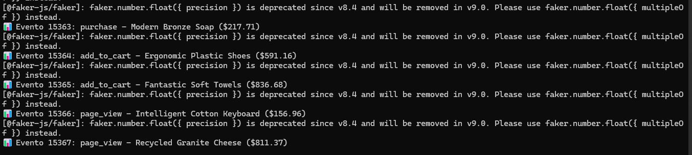
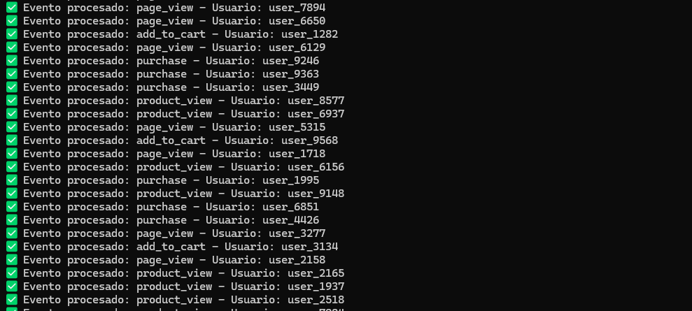

## Local Development Setup
* Install [Docker Desktop](https://www.docker.com/products/docker-desktop/)
* Install [Nodejs v16+](https://nodejs.org/id/blog/release/v16.16.0/) 

## Local Installation

* **Infraestructure Installation**: 

  * Git Clone repository in folder local. Forw example: D:\lab\analytics\ (windows) or home/lab/analytics/ (Linux)
  * Into folder local, Go to root project \
  * Execute the instruction: > docker-compose up -d
  * Verify docker containers up
  * Verificar RabbitMQ Management
     * curl http://localhost:15672
     <!--    Usuario: admin, Contraseña: admin123 -->
  * Verificar MongoDB
    * curl http://localhost:8081
     <!--   Usuario: admin, Contraseña: admin123 -->
  * Verificar conexión MongoDB directa
     * Ejecutar: >docker exec -it ecommerce-mongodb mongosh -u admin -p admin123

* **Development Installation**: 

  * Go to folder /src/consumer
  * Into folder execute: > npm install
  * Go to folder /src/producer
  * Into folder execute: > npm install
  * Go to folder /src/producer
  * Into folder execute: > npm start
  * Go to folder /src/consumer
  * Into folder execute: > npm start
  * Verify Start Succes Producer 
  * Verify Start Succes Consumer 
 

